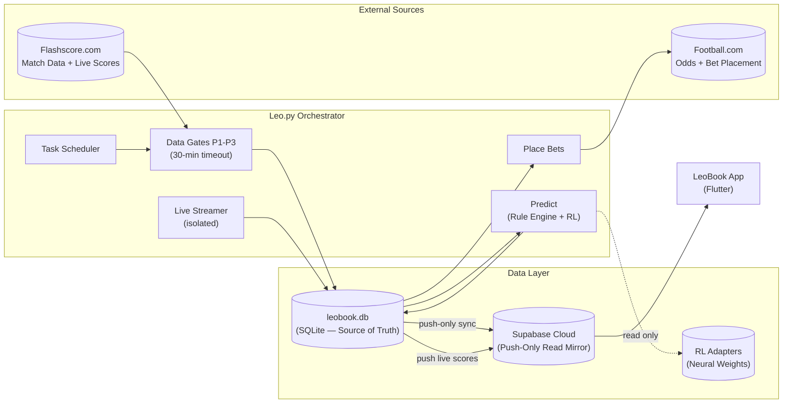

> **Version**: 8.1.0 "Stairway Engine" · **Last Updated**: 2026-03-10 · **Architecture**: 3-Phase RL (Poisson Grounding) + 30-dim Action Space + Chapter 1 v9.0 Direct Harvesting + Safety Guardrails v1.0

## Table of Contents

1. [System Overview](#1-system-overview)
2. [Project File Map](#2-project-file-map)
3. [Leo.py — Step-by-Step Execution Flow](#3-leopy--step-by-step-execution-flow)
4. [Design & UI/UX](#4-design--uiux)
5. [Data Flow Diagram](#5-data-flow-diagram)
6. [Bet Safety Guardrails](#6-bet-safety-guardrails)
7. [Model Performance & Open Quests](#7-model-performance--open-quests)
8. [Testing Strategy](#8-testing-strategy)
9. [Observability & Logging](#9-observability--logging)

---

## 1. System Overview

LeoBook is an **autonomous sports prediction and betting system** comprised of two halves:

| Half                      | Technology                         | Purpose                                                                                                                                  |
| ------------------------- | ---------------------------------- | ---------------------------------------------------------------------------------------------------------------------------------------- |
| **Backend (Leo.py)**      | Python 3.12 + Playwright + PyTorch | Autonomous data extraction, rule-based + neural RL prediction, odds harvesting, automated bet placement, and **dynamic task scheduling** |
| **Frontend (leobookapp)** | Flutter/Dart (flutter_bloc/Cubit)  | Dashboard with "Telegram-grade" density, liquid glass aesthetics, and proportional scaling                                               |

### Architecture Principles

- **SQLite is the single source of truth.** All data originates in `leobook.db`. Supabase is a **push-only read mirror** — the Flutter app reads from Supabase, but no data flows back from Supabase to SQLite during normal operation.
- **Push-Only Sync.** `SyncManager` uses watermark-based delta detection. Only rows modified since the last watermark are pushed. Zero reads from Supabase during sync.
- **One-Time Bootstrap.** If a local SQLite table is empty (fresh install or post-corruption), `_bootstrap_from_remote()` pulls from Supabase once, then the watermark is set to `now()` to resume push-only behavior. The `--pull` CLI command also triggers a full bootstrap.
- **Supervisor-Worker Pattern.** Leo.py is powered by a `Supervisor` orchestrator that dispatches isolated workers for each chapter, ensuring failure recovery and state persistence.
- **Data Readiness Gates.** Prologue P1-P3 verify data completeness before predictions. O(1) gate checks are powered by a materialized `readiness_cache` in the database.
- **Standings** are computed on-the-fly via a Postgres VIEW in Supabase.

### Data Extraction Strategy

LeoBook uses **two external data sources** for distinct purposes:

| Source             | Purpose                                                                    | Method                                              |
| ------------------ | -------------------------------------------------------------------------- | --------------------------------------------------- |
| **Flashscore.com** | Match data, scores, team/league metadata, historical fixtures, live scores | Playwright browser automation (headful or headless) |
| **Football.com**   | Odds harvesting, bet placement (Nigeria/Ghana region)                      | Direct API-style Harvesting (v9.0 stable)           |

> [!NOTE]
> Flashscore is used for data extraction only — no bets are placed there. Football.com is used exclusively for Nigeria/Ghana-region odds and bet placement. The separation is intentional: Flashscore has globally comprehensive match data; Football.com has the target betting platform.

---

## 2. Project File Map

### 2.1 Root Files

| File                  | Function                                                                               | Called by Leo.py? |
| --------------------- | -------------------------------------------------------------------------------------- | :---------------: |
| `Leo.py`              | Autonomous orchestrator — manages the entire system loop via Supervisor                |  **Entrypoint**   |
| `Leo_v70_legacy.py`   | v7.0 monolithic rollback target                                                        |     Fallback      |
| `RULEBOOK.md`         | Developer rules and philosophy (MANDATORY reading for all contributors and AI agents). |         —         |
| `PROJECT_STAIRWAY.md` | The capital compounding strategy ("why LeoBook must exist")                            |         —         |
| `requirements.txt`    | Core Python dependencies                                                               |         —         |
| `requirements-rl.txt` | PyTorch CPU + RL dependencies                                                          |         —         |

### 2.2 `Core/` — System Infrastructure

| Directory               | Files                                                                                                                                       | Purpose                                                                                                                                 |
| ----------------------- | ------------------------------------------------------------------------------------------------------------------------------------------- | --------------------------------------------------------------------------------------------------------------------------------------- |
| `Core/Intelligence/`    | `rule_engine.py`, `learning_engine.py`, `rule_engine_manager.py`, `aigo_engine.py`, `aigo_suite.py`, **`ensemble.py`**                      | AI engine, AIGO self-healing, adaptive learning, **Neuro-Symbolic Ensemble**                                                            |
| `Core/Intelligence/rl/` | `trainer.py`, `inference.py`, `model.py`, **`market_space.py`**                                                                             | Neural RL engine — 30-dim Multi-Action Space + Phased Training (see [Phased RL Lifecycle](#phased-rl-lifecyle))                         |
| `Core/System/`          | **`supervisor.py`**, **`worker_base.py`**, **`pipeline_workers.py`**, **`data_readiness.py`**, **`data_quality.py`**, **`gap_resolver.py`**, **`guardrails.py`** | **Supervisor orchestrator**, **BaseWorker class**, **Chapter Workers**, **Readiness Gates**, **Data Quality Scanner**, **Gap Resolver**, **Bet Safety Guardrails** |
| `Core/Utils/`           | `constants.py`                                                                                                                              | Shared constants including `now_ng` (see [Timezone](#timezone-anchor-now_ng))                                                           |

#### Phased RL Lifecycle (v8.0 "Stairway Engine")

The RL model uses a **30-dimensional action space** (defined in `market_space.py`) with a phased training lifecycle:

- **Phase 1 (Imitation Learning)**: Bootstraps the model using **Poisson-grounded labels** derived from xG metrics (1.20 home / 0.82 away multiplier). Ensures basic sports logic before RL rewards take over.
- **Phase 2 (Value Learning)**: Introduces KL Divergence penalties against the Poisson expert and real money rewards (PPO). Activates once >100 odds rows are harvested.
- **Phase 3 (Adapter Specialization)**: Freezes the SharedTrunk and fine-tunes league-specific adapters. Activates once >500 matches are recorded for a league.
- **Registry**: `AdapterRegistry` tracks all known leagues/teams. Saved to `Data/Store/models/adapter_registry.json`.
- **Inference**: High-velocity prediction (30 actions) gated by the **Stairway Gate** (1.20 ≤ odds ≤ 4.00). Returns EV-weighted recommendations.

#### RL Validation Suite (Backtest & Paper Trading)
LeoBook employs a dual-validation strategy to ensure model reliability before real capital is deployed:

- **Walk-Forward Backtest Harness** (`backtest.py`):
    - Implementation of rolling-window training and next-day evaluation.
    - Slices history into 90-day training windows to prevent data leakage.
    - Measures accuracy, coverage, synthetic ROI, and calibration quartiles.
- **Paper Trading Log** (`paper_trades` table):
    - Auto-logged during live Chapter 1, Page 2 cycles.
    - Simulates the **Project Stairway 7-step Ladder** (₦1,000 → ₦729,000).
    - Resolved asynchronously by `outcome_reviewer.py` once match scores are final.
    - Viewable via `python Leo.py --paper-summary`.

#### Timezone Anchor: `now_ng`

`now_ng` uses **West Africa Time (WAT, UTC+1)** as the system clock. This is intentional:
- Football.com operates exclusively in Nigeria/Ghana, both WAT timezone.
- Developer location is WAT.
- Cross-league timezone normalization (UTC/CET for European leagues) is a planned future enhancement.
- **Edge case to watch**: European daylight saving transitions may cause 1-hour misalignment in match time parsing during DST transition weeks.

### 2.3 `Modules/` — Domain Logic

| File                                     | Function                                                          |
| ---------------------------------------- | ----------------------------------------------------------------- |
| `Modules/Flashscore/fs_processor.py`     | Per-match H2H + Enrichment + Search Dict                          |
| `Modules/Flashscore/fs_live_streamer.py` | Isolated live score streaming + outcome review + accuracy reports |
| `Modules/FootballCom/fb_manager.py`      | Odds harvesting, automated booking                                |

### 2.4 `Data/` — Persistence Layer

| File                                 | Function                                                                             |
| ------------------------------------ | ------------------------------------------------------------------------------------ |
| `Data/Access/league_db.py`           | SQLite schema, `computed_standings()` helper, auto-corruption recovery               |
| `Data/Access/sync_manager.py`        | `SyncManager` — **push-only** watermark sync (SQLite → Supabase only)                |
| `Data/Access/db_helpers.py`          | High-level DB operations, team/league/prediction CRUD, **materialized cache tables** |
| `Data/Access/outcome_reviewer.py`    | Outcome review logic                                                                 |
| `Data/Access/season_completeness.py` | **SeasonCompletenessTracker** — coverage metrics per league/season                   |

### 2.5 `Scripts/` — Pipeline Scripts

| File                           | Function                                                               |
| ------------------------------ | ---------------------------------------------------------------------- |
| `Scripts/enrich_leagues.py`    | League metadata + Historical data enrichment                           |
| `Scripts/build_search_dict.py` | LLM-powered search term/abbreviation enrichment (with circuit breaker) |
| `Scripts/recommend_bets.py`    | Recommendation engine                                                  |

#### Enrichment Data Extraction Strategy

| Data Point       | Extraction Method                                    | Source                                          |
| ---------------- | ---------------------------------------------------- | ----------------------------------------------- |
| `fs_league_id`   | `window.leaguePageHeaderData.tournamentStageId`      | Flashscore internal JS config                   |
| `region`         | 2nd `.breadcrumb__link` element (index 1)            | Breadcrumb navigation                           |
| `crest`          | `img.heading__logo` `src` attribute                  | League page header                              |
| `current_season` | `.heading__info` with year regex                     | League page header                              |
| `match_link`     | `<a class="eventRowLink" aria-describedby="g_1_ID">` | Match row sibling                               |
| `team_id`        | Parsed from `eventRowLink` href segments             | Match link URL path                             |
| `region_league`  | `"{region}: {league_name}"`                          | Constructed from extracted region + league name |

> [!IMPORTANT]
> All CSS selectors MUST live in `Config/knowledge.json` and be accessed via `SelectorManager`. Zero hardcoded selectors in Python/JS code.

> [!WARNING]
> `region_flag` images cannot be downloaded — Flashscore uses CSS sprite backgrounds for country flags, not `` tags. The `region_flag` column stores the URL for reference but the actual image is not downloadable via standard methods.

---

### 2.6 Command Line Interface

Leo.py supports two modes of operation:

**Normal Cycle**: `python Leo.py` — runs the full autonomous pipeline (Prologue → Chapter 1 → Chapter 2 → Sleep → repeat).

**Utility Commands** (single-shot, no cycle loop):

| Command                              | Purpose                                                                                                                                                              |
| ------------------------------------ | -------------------------------------------------------------------------------------------------------------------------------------------------------------------- |
| `--enrich-leagues`                   | **Gap-scan mode**: detects NULL/missing fields across the DB and fetches only those gaps. Does NOT reset existing data.                                              |
| `--enrich-leagues --limit START-END` | **Range-reset mode**: reprocesses the specified ordinal range regardless of prior state. START-END refers to position in the enrichment queue, not database row IDs. |
| `--enrich-leagues --season N`        | Target a specific past season (1 = latest past season)                                                                                                               |
| `--enrich-leagues --seasons N`       | Cumulative: fetch the last N seasons                                                                                                                                 |
| `--enrich-leagues --weekly`          | Lightweight refresh for incremental updates                                                                                                                          |
| `--sync`                             | Force push-only sync (SQLite → Supabase)                                                                                                                             |
| `--pull`                             | Full bootstrap pull (Supabase → SQLite). Deletes and recreates local DB tables.                                                                                      |
| `--search-dict`                      | Rebuild search dictionary via LLM enrichment                                                                                                                         |
| `--prologue`                         | Run all Prologue pages (P1+P2+P3)                                                                                                                                    |
| `--data-quality`                     | Run column-level gap scan + Invalid ID detection + Season completeness init                                                                                          |
| `--season-completeness`              | Show summary report of league-season coverage (%)                                                                                                                    |
| `--backtest-rl`                      | Run RL Walk-Forward Backtest (rolling training + next-day eval)                                                                                                      |
| `--bt-start`, `--bt-end`             | Set start/end dates for RL Backtest (e.g., 2026-01-01)                                                                                                               |
| `--paper-summary`                    | Display aggregated statistics from the Paper Trading Log                                                                                                             |
| `--bypass-cache`                     | Force O(N) scan for Prologue gates, skipping materialized cache                                                                                                      |
| `--set-expected-matches`             | Manually override expected match count for a season                                                                                                                  |

---

## 3. Leo.py — Step-by-Step Execution Flow (v7.2)

Leo.py orchestrates the cycle with autonomous task management:

### Startup Flow (Bootstrap)
1. **Singleton Check**: Creates `leo.lock` at runtime. If `leo.lock` exists from a prior run, startup halts to prevent duplicate instances. Lock is released on clean shutdown. If Leo.py crashes without releasing the lock, the stale lock file must be manually deleted.
2. **Startup Sync**: Call `run_startup_sync()` — push-only sync to ensure Supabase parity. If local DB is empty/missing, auto-bootstraps from Supabase.
3. **Streamer Ignition**: Spawn isolated streamer task AFTER sync completes.

### Supervisor orchestrator (Autonomous Loop)
1. **Supervisor Initialization**: Loads `system_state` from SQLite. Instantiates chapter workers.
2. **Cycle Hub**: Checks `scheduler` for next wake time. If target reached, dispatches workers sequentially.
3. **Worker Execution**: Each worker (P1, P2, Ch1, Ch2) executes in isolation. Failures are captured, state is saved, and retries are managed by the Supervisor.
21. **Prologue (Data Readiness Gates)**:
    - **P1: Quantity & ID Gate**: Leagues ≥ 90% coverage AND teams ≥ 3 per processed league. Validates IDs. O(1) lookup via `readiness_cache`.
    - **P2: History & Quality Gate**: Verify 2+ distinct seasons. Logic: pass if 0 critical gaps AND 0 completed season mismatches. **ACTIVE seasons ignored.** 
    - **P3: AI Gate**: RL base model + league adapters exist. **Phase Auto-Detection** checks `match_odds` and `fixtures` counts to unlock Phase 2/3.
    - *All gates use a 30-minute auto-remediation timeout. If they fail, they return `NOT READY` and block the pipeline until auto-remediation or manual fix.*
3. **Chapter 1: Prediction Pipeline**:
    - **P1**: **URL Resolution & Direct Odds Harvesting** (v9.0 stable, 181 page loads vs 1532 fixtures).
    - **P2**: Predictions (**30-dim Stairway Engine**). **Data Leak Guard**: Max 1 prediction per team per week. 
    - **P3**: Final Chapter Sync (push-only watermark delta) & **EV-Positive Recommendation** generation (Odds 1.20–4.00).
4. **Chapter 2: Betting & Funds**:
    - **P1**: Automated Booking on Football.com (see [Safety Guardrails](#6-bet-safety-guardrails)).
    - **P2**: Funds balance + withdrawal check.
5. **Cycle Complete — Dynamic Sleep**:
    - Log completion.
    - Consult `scheduler.next_wake_time()`.
    - Sleep until next task or default interval.

---

## 4. Design & UI/UX

The LeoBook Flutter app (`leobookapp/`) reads exclusively from Supabase. It is a pure read client — no data flows from the app back to the backend.

---

## 5. Data Flow Diagram

> [!NOTE]
> Data ownership is strictly directional:
> - **Leo.py → SQLite**: all writes (predictions, schedules, live scores, teams, leagues)
> - **SQLite → Supabase**: push-only sync (watermark delta, no reads)
> - **Supabase → Flutter App**: read only (computed views)
> - **Supabase → SQLite**: only during `--pull` bootstrap (one-time or manual)

---

## 6. Bet Safety Guardrails

> [!IMPORTANT]
> Chapter 2 (automated bet placement) involves real money. All safety guardrails are **implemented and enforced** in `Core/System/guardrails.py` (v1.0, March 10, 2026). Chapter 2 cannot execute without passing all checks.

### All Implemented (v1.0)

| Guardrail                   | Status         | Module / Function                 | Description                                                                                                  |
| --------------------------- | -------------- | --------------------------------- | ------------------------------------------------------------------------------------------------------------ |
| **Audit Logging**           | ✅ Implemented | `db_helpers.log_audit_event()`     | Every bet cycle writes to `audit_log` with balance_before/after, stake, event_type, status.                  |
| **Confidence Gating**       | ✅ Implemented | `prediction_pipeline.py`           | Predictions below confidence threshold are marked `SKIP`.                                                    |
| **Max 1/team/week**         | ✅ Implemented | `prediction_pipeline.py`           | Data leak guard prevents stale-data predictions.                                                             |
| **Dry-Run Mode**            | ✅ Implemented | `guardrails.enable_dry_run()`      | `--dry-run` flag blocks all bet execution. Logs simulated actions to audit_log.                              |
| **Kill Switch**             | ✅ Implemented | `guardrails.check_kill_switch()`   | `STOP_BETTING` file halts all betting immediately. Delete file to resume.                                    |
| **Max Stake Cap**           | ✅ Implemented | `guardrails.StaircaseTracker`      | Stake capped to Stairway table step value (₦1,000 at step 1 → ₦2,048,000 at step 7). Replaces hardcoded 50%. |
| **Staircase State Machine** | ✅ Implemented | `guardrails.StaircaseTracker`      | 7-step state machine persisted in SQLite. Win → advance, Loss → reset to step 1. Cycle count tracked.        |
| **Balance Sanity Check**    | ✅ Implemented | `guardrails.check_balance_sanity()`| Blocks betting if balance < ₦500 (configurable via `MIN_BALANCE_BEFORE_BET`).                                |
| **Daily Loss Limit**        | ✅ Implemented | `guardrails.check_daily_loss_limit()`| Sums today's losses from audit_log. Halts if ≥ ₦5,000 (configurable via `DAILY_LOSS_LIMIT`).               |

### Guardrail Enforcement Points

| Location | Check | Effect |
|----------|-------|--------|
| `Leo.py` dispatch (Chapter 2) | `run_all_pre_bet_checks()` | Blocks entire chapter if any check fails |
| `fb_manager.run_automated_booking()` | `check_kill_switch()` + `is_dry_run()` | Blocks booking before browser launch |
| `placement.place_multi_bet_from_codes()` | `run_all_pre_bet_checks()` | Blocks individual bet execution |
| `placement.calculate_kelly_stake()` | `StaircaseTracker.get_max_stake()` | Caps stake to current Stairway step |

---

## 7. Model Performance & Open Quests

> [!IMPORTANT]
> LeoBook is in **active development — modular testing phase**. No end-to-end pipeline test has been completed. The numbers below are preliminary and will be updated after full pipeline validation.

### Current State

| Metric                   | Value             | Notes                                                        |
| ------------------------ | ----------------- | ------------------------------------------------------------ |
| Action Space             | 30 Actions        | Expanded from 8 in v8.0 (1X2, DC, OU, BTTS)                  |
| RL Training Accuracy     | Phase 1 Stable    | Poisson expert grounding provides robust base for imitation. |
| Rule Engine Accuracy     | Untested at scale | Individual rule components work; aggregate accuracy unknown. |
| Calibration              | 3-Phase PPO       | v8.0 introduces KL divergence for stable calibration.        |
| Per-Step Win Probability | Unmeasured        | The foundational number for Project Stairway viability.      |

### Open Quests (To Be Answered by Pipeline Testing)

1. What is LeoBook's actual per-step win probability on selected bets at ~4.0 odds?
2. How does win probability vary by league, sport, and season stage?
3. Is the optimal step target a single match at 4.0, or a 2-3 match accumulator multiplying to 4.0?
4. What is the empirically observed calibration of the model?
5. What is the expected number of cycles before a full 7-step staircase completes?
6. What is the optimal confidence threshold gate for bet placement?

These questions will be answered by data, not assumption.

---

## 8. Testing Strategy

### Current State

| Layer             | Status            | Notes                            |
| ----------------- | ----------------- | -------------------------------- |
| Unit Tests        | ❌ Not implemented | No `tests/` directory exists yet |
| Widget Tests      | ❌ Not implemented | Flutter app has no test coverage |
| Integration Tests | ❌ Not implemented | No end-to-end pipeline test      |
| CI/CD             | ❌ Not configured  | No GitHub Actions or equivalent  |

### Planned Testing Architecture

| Layer           | Scope                                                                    | Tools                                    |
| --------------- | ------------------------------------------------------------------------ | ---------------------------------------- |
| **Unit**        | Repositories, rule engine, reward computation, feature encoder           | `pytest` + `mocktail`                    |
| **Integration** | Full pipeline: Enrichment → Prediction → Recommendation → Sync           | `pytest` with SQLite test fixtures       |
| **E2E**         | Dry-run bet placement cycle with mock Football.com responses             | `playwright` + `pytest`                  |
| **Flutter**     | Widget tests + golden tests for UI components                            | `flutter_test` + `patrol`                |
| **Regression**  | Accuracy tracking across commits — detect prediction quality regressions | Custom script + `accuracy_reports` table |

### Priority Order for Implementation
1. Rule engine unit tests (highest value: validates prediction correctness)
2. Sync manager integration tests (validates data integrity)
3. Dry-run bet placement E2E test (validates safety before real money)
4. Flutter widget tests

---

## 9. Observability & Logging

### Terminal Logging

- **Setup**: `setup_terminal_logging()` in `lifecycle.py` configures log format and handlers.
- **Log Location**: `Data/Log/Terminal/` — session-stamped log files (`leo_session_YYYYMMDD_HHMMSS.log`).
- **State Snapshots**: `log_state()` writes structured state transitions (chapter/phase/action) for debugging.

### Audit Logging

- **Target**: `audit_log` table in both SQLite and Supabase.
- **Scope**: Every bet cycle, balance change, and system event is recorded with timestamp, balance_before/after, stake, and status.
- **Function**: `log_audit_event()` in `db_helpers.py`.

### LLM Health Monitoring

- **Manager**: `llm_health_manager.py` tracks Gemini key rotation (36 keys × 5 models) and Grok API health.
- **Time-Based Cooldowns**: 429 rate-limited keys auto-recover after 65 seconds (replaced permanent exhaustion). Added March 10, 2026.
- **Exponential Backoff**: Consecutive 429s trigger `min(2^n, 30)` second delays in `build_search_dict.py` and `api_manager.py`.
- **Circuit Breaker**: `build_search_dict.py` checks `health_manager._gemini_active` before each batch — if all providers are dead, skips remaining work instantly.

### Monitoring

- **File**: `Core/System/monitoring.py` — cycle health checks, anomaly detection.
- **Future**: Structured JSON-line logging for easier querying and alerting.

---

---

### RL Overhaul v8.0 "Stairway Engine" (March 9, 2026)
- **30-Dimension Action Space**: Full coverage for 1X2, Double Chance, Over/Under (1.5, 2.5, 3.5), and BTTS.
- **Poisson Expert Signal**: Phase 1 training now uses a physics-informed Poisson grounding (derived from xG) for stable imitation learning.
- **Phase Auto-Detection**: ML pipeline automatically transitions from Phase 1 (Imitation) → Phase 2 (PPO + KL) → Phase 3 (Specialization) based on data density.
- **Stairway Gate Implementation**: Hard enforcement of 1.20–4.00 odds range and EV-positive checks in `ensemble.py`.
- **xG Multiplier Alignment**: Unified 1.20 (Home) / 0.82 (Away) multipliers across `goal_predictor.py` and `feature_encoder.py`.
- **Chapter 1 v9.0 Stable**: Direct harvesting engine refined; concurrent processing capped at 2 in Codespaces to prevent memory exhaustion.

### Safety Guardrails v1.0 (March 10, 2026)
- **6 Guardrails in `Core/System/guardrails.py`**: Dry-run, kill switch, staircase state machine, max stake cap, balance sanity, daily loss limit.
- **Staircase State Machine**: 7-step compounding tracker persisted in SQLite `stairway_state` table. Win → advance, loss → reset.
- **Triple Enforcement**: Guardrails checked at Leo.py dispatch, fb_manager booking entry, and placement execution.

### Gemini 429 Rate-Limit Fix (March 10, 2026)
- **Time-Based Cooldowns**: Replaced permanent key exhaustion with 65-second auto-recovery in `llm_health_manager.py`.
- **Exponential Backoff**: `min(2^n, 30)` second delays on consecutive 429s in `build_search_dict.py` and `api_manager.py`.

*Last updated: March 10, 2026 (v8.1.0 — Safety Guardrails + 429 Fix)*
*LeoBook Engineering Team — Materialless LLC*
