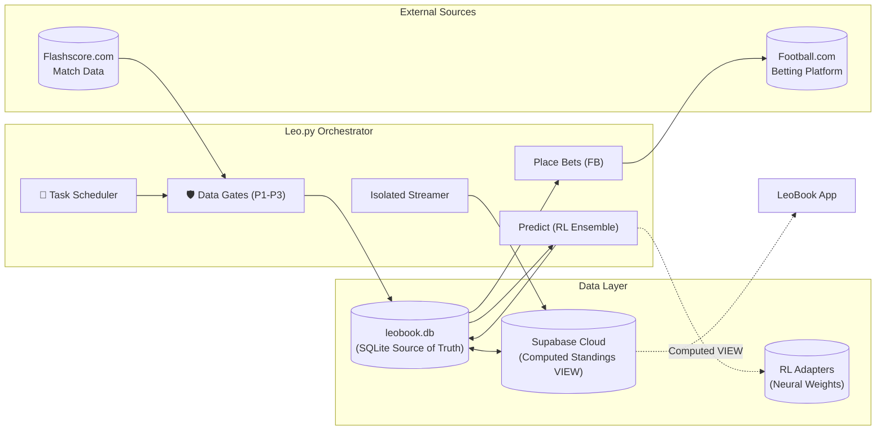

> **Version**: 7.0 · **Last Updated**: 2026-03-03 · **Architecture**: Autonomous High-Velocity Architecture (Task Scheduler + Data Readiness Gates + Neural RL)

## Table of Contents

1. [System Overview](#1-system-overview)
2. [Project File Map](#2-project-file-map)
3. [Leo.py — Step-by-Step Execution Flow](#3-leopy--step-by-step-execution-flow)
4. [Design & UI/UX](#4-design--uiux)
5. [Data Flow Diagram](#5-data-flow-diagram)

---

## 1. System Overview

LeoBook is an **autonomous sports prediction and betting system** comprised of two halves:

| Half | Technology | Purpose |
|------|-----------|---------||
| **Backend (Leo.py)** | Python 3.12 + Playwright + PyTorch | Autonomous data extraction, rule-based + neural RL prediction, odds harvesting, automated bet placement, and **dynamic task scheduling** |
| **Frontend (leobookapp)** | Flutter/Dart (flutter_bloc/Cubit) | Dashboard with "Telegram-grade" density, liquid glass aesthetics, and proportional scaling |

**Leo.py** is an **autonomous orchestrator** powered by a **dynamic Task Scheduler** (`Core/System/scheduler.py`). It no longer relies on a static 6h loop; instead, it wakes up at target task times or operates at default intervals. The system enforces **Data Readiness Gates** (Prologue P1-P3) to ensure data integrity before predictions. **Standings** are now computed on-the-fly via a Postgres VIEW in Supabase, eliminating redundant sync tables.

---

## 2. Project File Map

### 2.1 Root Files

| File | Function | Called by Leo.py? |
|------|----------|:-:|
| `Leo.py` | Autonomous orchestrator — manages the entire system loop | **Entrypoint** |
| `RULEBOOK.md` | Developer rules (MANDATORY reading) | — |
| `requirements.txt` | Core Python dependencies | — |
| `requirements-rl.txt` | PyTorch CPU + RL dependencies | — |

### 2.2 `Core/` — System Infrastructure

| Directory | Files | Purpose |
|-----------|-------|---------|
| `Core/Intelligence/` | `rule_engine.py`, `learning_engine.py`, `rule_engine_manager.py`, `aigo_engine.py`, `aigo_suite.py` | AI engine, AIGO self-healing, adaptive learning |
| `Core/Intelligence/rl/` | `trainer.py`, `inference.py`, `model.py` | Neural RL engine — SharedTrunk + LoRA adapters |
| `Core/System/` | **`scheduler.py`**, **`data_readiness.py`**, `lifecycle.py`, `monitoring.py` | **Autonomous Scheduler**, **Data Gates**, CLI parsing, oversight |
| `Core/Utils/` | `constants.py` | Shared constants (`now_ng` Nigerian time) |

### 2.3 `Modules/` — Domain Logic

| File | Function |
|------|----------|
| `Modules/Flashscore/fs_processor.py` | Per-match H2H + Enrichment + Search Dict |
| `Modules/Flashscore/fs_live_streamer.py` | Isolated live score streaming + outcome review |
| `Modules/FootballCom/fb_manager.py` | Odds harvesting, automated booking |

### 2.4 `Data/` — Persistence Layer

| File | Function |
|------|----------|
| `Data/Access/league_db.py` | SQLite schema, **`computed_standings()`** helper |
| `Data/Access/sync_manager.py` | `SyncManager` — bi-directional sync (minus computed tables) |
| `Data/Access/outcome_reviewer.py` | Outcome review logic |

### 2.5 `Scripts/` — Pipeline Scripts

| File | Function |
|------|----------|
| `Scripts/enrich_leagues.py` | League metadata + Historical data (**`--weekly` mode**) |
| `Scripts/recommend_bets.py` | Recommendation engine |

---

## 3. Leo.py — Step-by-Step Execution Flow (v7.0)

Leo.py orchestrates the cycle with autonomous task management:

### Startup Flow (Bootstrap)
1. **Singleton Check**: Ensure only one instance runs.
2. **Startup Sync**: Call `run_startup_sync()` to ensure DB parity before ANY other tasks start.
3. **Streamer Ignition**: Spawn isolated streamer task AFTER sync completes.

### Autonomous Cycle Loop
1. **Task Scheduler Check**: Execute pending tasks (`weekly_enrichment`, `day_before_predict`).
2. **Prologue (Data Readiness Gates)**:
    - **P1: Quantity Gate**: Threshold check (Leagues/Teams).
    - **P2: History Gate**: Historical season fixtures check.
    - **P3: AI Gate**: RL Adapter training check.
    - *Auto-remediation triggers if any gate fails.*
3. **Chapter 1: Prediction Pipeline**:
    - **P1**: URL Resolution & Odds Harvesting.
    - **P2**: Predictions (Constraint: Max 1/team/week). Surplus matches added to Scheduler.
    - **P3**: Final Chapter Sync & Recommendation Generation.
4. **Chapter 2: Betting & Funds**:
    - **P1**: Automated Booking on Football.com.
    - **P2**: Funds balance + withdrawal check.
5. **Cycle Complete — Dynamic Sleep**:
    - Log completion.
    - Consult `scheduler.next_wake_time()`.
    - Sleep until next task or default interval.

---

## 4. Data Flow Diagram

---
*Last updated: March 3, 2026 (v7.0 — Autonomous Scheduler Architecture)*
*LeoBook Engineering Team*
