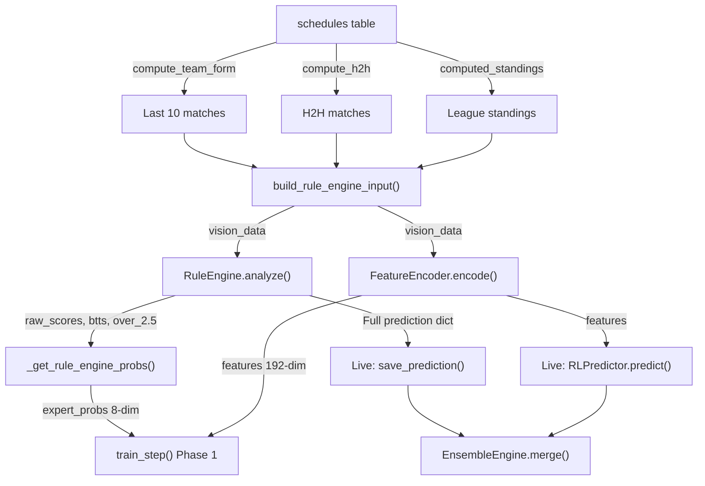

# RL First-Principles Data Audit

**Date:** 2026-03-08  
**Scope:** Complete trace of the Rule Engine data pipeline — every parameter, computation, SQL query, and data source — and all mismatches between live inference and Phase 1 RL training.

---

## Table of Contents

1. [Section 1 — Last 10 Matches (Team Form)](#section-1--last-10-matches-team-form)
2. [Section 2 — Head-to-Head (H2H) — 18-Month Rule](#section-2--head-to-head-h2h--18-month-rule)
3. [Section 3 — Standings (League Position)](#section-3--standings-league-position)
4. [Section 4 — Rule Engine Prediction Assembly](#section-4--rule-engine-prediction-assembly)
5. [Section 5 — Gaps & Mismatches (Critical)](#section-5--gaps--mismatches-critical)
6. [Prioritized Fix List](#prioritized-fix-list)

---

## Section 1 — Last 10 Matches (Team Form)

### 1.1 Query Level

#### Live Prediction Query

**File:** [prediction_pipeline.py](file:///c:/Users/Admin/Desktop/ProProjection/LeoBook/Core/Intelligence/prediction_pipeline.py#L94-L110)  
**Function:** `compute_team_form(conn, team_id, limit=10)`

```sql
SELECT * FROM schedules
WHERE (home_team_id = ? OR away_team_id = ?)
  AND home_score IS NOT NULL AND away_score IS NOT NULL
  AND home_score != '' AND away_score != ''
ORDER BY date DESC
LIMIT ?
```

- **Table:** `schedules` (SQLite)
- **Columns selected:** `*` (all columns)
- **Filter:** Combined (home OR away). NOT filtered by home/away separately.
- **"Last 10" determined by:** `ORDER BY date DESC LIMIT 10`
- **Cancelled/postponed/abandoned exclusion:** **NO** — there is no `match_status` filter. Any row with a non-NULL, non-empty score is included, regardless of `match_status`.
- **Fewer than 10 matches:** Proceeds with fewer. The data quality gate in [run_predictions](file:///c:/Users/Admin/Desktop/ProProjection/LeoBook/Core/Intelligence/prediction_pipeline.py#L248-L254) skips matches with `< 3` form matches per team (line 252). This uses `config.min_form_matches = 3` from [rule_config.py](file:///c:/Users/Admin/Desktop/ProProjection/LeoBook/Core/Intelligence/rule_config.py#L39).

#### RL Training Query

**File:** [trainer.py](file:///c:/Users/Admin/Desktop/ProProjection/LeoBook/Core/Intelligence/rl/trainer.py#L460-L481)  
**Function:** `RLTrainer._get_team_form(conn, team_id, team_name, before_date)`

```sql
SELECT date, home_team_name, away_team_name, home_score, away_score
FROM schedules
WHERE (home_team_id = ? OR away_team_id = ?)
  AND date < ?
  AND home_score IS NOT NULL
ORDER BY date DESC
LIMIT 10
```

> [!CAUTION]
> **Mismatch #1:** Training query selects **5 columns** vs live query selects **all columns (`*`)**.  
> **Mismatch #2:** Training query only checks `home_score IS NOT NULL` — does NOT check `away_score IS NOT NULL` or `!= ''`.  
> **Mismatch #3:** Neither query filters on `match_status`, which means that aborted/postponed matches with partial scores can leak into form calculations.

### 1.2 Feature Extraction

Each match from the 10-match form is converted by [_schedule_to_match_dict](file:///c:/Users/Admin/Desktop/ProProjection/LeoBook/Core/Intelligence/prediction_pipeline.py#L29-L64) (live path) into:

```python
{
    "home": row["home_team_name"],
    "away": row["away_team_name"],
    "score": f"{home_score}-{away_score}",  # e.g. "2-1"
    "winner": "Home" | "Away" | "Draw",
    "date": row["date"],
    "fixture_id": row["fixture_id"],
}
```

Training path (_get_team_form) produces:
```python
{
    "date": row[0],
    "home": row[1],
    "away": row[2],
    "score": f"{row[3]}-{row[4]}",
}
```

> [!CAUTION]
> **Mismatch #4:** Training match dicts are **missing the `winner` field**. `TagGenerator._parse_match_result()` ([tag_generator.py:41-63](file:///c:/Users/Admin/Desktop/ProProjection/LeoBook/Core/Intelligence/tag_generator.py#L41-L63)) reads `match.get("winner", "")`. With no `winner` key, the W/D/L logic falls through to a raw score reparse — but the fallback code uses `winner == "Home"` / `"Away"` / `"Draw"`, so an empty string means ALL results classify as **losses**, corrupting form tags during training.
>
> **Mismatch #5:** Training match dicts are **missing `fixture_id`** — minor, doesn't affect predictions.

#### Recency Weighting

- **Rule Engine:** NO recency weighting. The 10 matches are treated equally for tag thresholds.
- **FeatureEncoder (RL):** YES, recency weighting. Defined in [feature_encoder.py:21-23](file:///c:/Users/Admin/Desktop/ProProjection/LeoBook/Core/Intelligence/rl/feature_encoder.py#L21-L23):

```python
_RECENCY_WEIGHTS = [math.exp(-0.1 * i) for i in range(10)]
# index 0 (most recent) = 1.0, index 9 = 0.368
```

Used in `_encode_form()` at [feature_encoder.py:144](file:///c:/Users/Admin/Desktop/ProProjection/LeoBook/Core/Intelligence/rl/feature_encoder.py#L144).

#### "Form" Value Passed to Rule Engine

The form value is a **list of dicts** (up to 10 match dicts), not a string or numeric vector. The Rule Engine passes it through:

1. **TagGenerator.generate_form_tags()** → list of string tags like `"TEAM_SLUG_FORM_S2+"`, `"TEAM_SLUG_FORM_CS"`, `"TEAM_SLUG_FORM_W"`
2. **GoalPredictor.predict_goals_distribution()** → probability distribution dict `{"goals_scored": {"0": p, "1": p, "2": p, "3+": p}, "goals_conceded": {...}}`

### 1.3 Derived Statistics (Computed from 10 Matches)

All computed in [tag_generator.py:65-134](file:///c:/Users/Admin/Desktop/ProProjection/LeoBook/Core/Intelligence/tag_generator.py#L65-L134) via `generate_form_tags()`:

| Statistic                        | Tag                       | Threshold                                             |
| -------------------------------- | ------------------------- | ----------------------------------------------------- |
| Fails to score                   | `TEAM_FORM_SNG`           | ≥ majority (> total/2) or ≥ third (≥ max(3, total/3)) |
| Clean sheets                     | `TEAM_FORM_CS`            | Same threshold logic                                  |
| Scores 1+                        | `TEAM_FORM_S1+`           | Same                                                  |
| Scores 2+                        | `TEAM_FORM_S2+`           | Same                                                  |
| Scores 3+                        | `TEAM_FORM_S3+`           | Same                                                  |
| Concedes 1+                      | `TEAM_FORM_C1+`           | Same                                                  |
| Concedes 2+                      | `TEAM_FORM_C2+`           | Same                                                  |
| Concedes 3+                      | `TEAM_FORM_C3+`           | Same                                                  |
| Wins                             | `TEAM_FORM_W`             | Same                                                  |
| Draws                            | `TEAM_FORM_D`             | Same                                                  |
| Losses                           | `TEAM_FORM_L`             | Same                                                  |
| Per-strength (vs top/mid/bottom) | `TEAM_FORM_{stat}_vs_{TOP | MID                                                   | BOTTOM}` | Third threshold, min 2 matches in strength band |

Additionally in [goal_predictor.py:18-70](file:///c:/Users/Admin/Desktop/ProProjection/LeoBook/Core/Intelligence/goal_predictor.py#L18-L70):
- Goals scored distribution (0, 1, 2, 3+) with home/away adjustment factor (×1.25 boost home, ×0.80 penalty away)
- Goals conceded distribution (same bins)

These are **raw proportions** (0-1 scale), NOT normalized separately.

### 1.4 Training vs Live Form

| Aspect                  | Live                              | Training    | Match?                   |
| ----------------------- | --------------------------------- | ----------- | ------------------------ |
| SQL columns             | `*`                               | 5 columns   | ❌                        |
| `away_score` null check | `IS NOT NULL AND != ''`           | Not checked | ❌                        |
| `match_status` filter   | None                              | None        | ✅ (both wrong)           |
| `winner` field          | Computed                          | **MISSING** | ❌ **CRITICAL**           |
| `fixture_id` field      | Present                           | Missing     | ❌ (minor)                |
| `date < ?` constraint   | No (uses current date implicitly) | Yes         | ✅ (correct for training) |

---

## Section 2 — Head-to-Head (H2H) — 18-Month Rule

### 2.1 The 18-Month Rule

**File:** [rule_config.py:38](file:///c:/Users/Admin/Desktop/ProProjection/LeoBook/Core/Intelligence/rule_config.py#L38)  
**Parameter:** `h2h_lookback_days: int = 540` (540 days = 18 months)

**Enforcement location:** [rule_engine.py:50-65](file:///c:/Users/Admin/Desktop/ProProjection/LeoBook/Core/Intelligence/rule_engine.py#L50-L65)

```python
cutoff = datetime.now() - timedelta(days=config.h2h_lookback_days)
h2h = []
for m in h2h_raw:
    if not m:
        continue
    try:
        date_str = m.get("date", "")
        if date_str:
            if "-" in date_str and len(date_str.split("-")[0]) == 4:
                d = datetime.strptime(date_str, "%Y-%m-%d")
            else:
                d = datetime.strptime(date_str, "%d.%m.%Y")
            if d >= cutoff:
                h2h.append(m)
    except:
        h2h.append(m)  # keep if date parse fails
```

- Cutoff = `datetime.now() - timedelta(days=540)` — applied **post-query in Python**, not in SQL.
- Date format handling: Supports both `YYYY-MM-DD` and `DD.MM.YYYY`.
- If date parsing fails, the match is **kept** (conservative fallback).

#### Zero H2H Matches

When no H2H matches pass the cutoff, `h2h` is an empty list. `TagGenerator.generate_h2h_tags([], ...)` returns `[]` (empty tags). The Rule Engine continues with form + standings only — **H2H contributes zero to scoring**.

### 2.2 Live H2H Query

**File:** [prediction_pipeline.py:113-130](file:///c:/Users/Admin/Desktop/ProProjection/LeoBook/Core/Intelligence/prediction_pipeline.py#L113-L130)  
**Function:** `compute_h2h(conn, home_team_id, away_team_id, limit=10)`

```sql
SELECT * FROM schedules
WHERE ((home_team_id = ? AND away_team_id = ?)
    OR (home_team_id = ? AND away_team_id = ?))
  AND home_score IS NOT NULL AND away_score IS NOT NULL
  AND home_score != '' AND away_score != ''
ORDER BY date DESC
LIMIT ?
```

- **Both directions:** Yes — `(A vs B) OR (B vs A)`
- **Max matches:** `LIMIT 10` (hardcoded default)
- **Cross-competition:** Yes — no `league_id` filter, so league + cup matches between the same teams are all included.

### 2.3 Training H2H Query

**File:** [trainer.py:483-505](file:///c:/Users/Admin/Desktop/ProProjection/LeoBook/Core/Intelligence/rl/trainer.py#L483-L505)  
**Function:** `RLTrainer._get_h2h(conn, home_id, away_id, before_date)`

```sql
SELECT date, home_team_name, away_team_name, home_score, away_score
FROM schedules
WHERE ((home_team_id = ? AND away_team_id = ?)
    OR (home_team_id = ? AND away_team_id = ?))
  AND date < ?
  AND home_score IS NOT NULL
ORDER BY date DESC
LIMIT 10
```

> [!CAUTION]
> **Mismatch #6:** The 18-month cutoff is applied in `rule_engine.py` (Python-side filter after data is fetched), but `_get_h2h()` in training does **NOT** apply the 540-day cutoff. It fetches the last 10 H2H matches with no time restriction, potentially including matches from 5+ years ago.
>
> This means the Rule Engine during Phase 1 training sees **stale H2H matches** that it would discard in live inference, producing different expert labels than a live run would generate.

> [!CAUTION]
> **Mismatch #7:** Same as form — training H2H match dicts are **missing the `winner` field**, causing `generate_h2h_tags()` to classify all H2H results incorrectly.

### 2.4 H2H Features & Weighting

**From H2H tags** (computed in [tag_generator.py:136-187](file:///c:/Users/Admin/Desktop/ProProjection/LeoBook/Core/Intelligence/tag_generator.py#L136-L187)):

| Tag                           | Meaning                              |
| ----------------------------- | ------------------------------------ |
| `HOME_SLUG_WINS_H2H`          | Home team wins majority/third of H2H |
| `AWAY_SLUG_WINS_H2H`          | Away team wins majority/third        |
| `H2H_D` / `H2H_D_third`       | Draws in H2H                         |
| `H2H_O25` / `H2H_O25_third`   | Over 2.5 goals in H2H                |
| `H2H_U25` / `H2H_U25_third`   | Under 2.5 goals in H2H               |
| `H2H_BTTS` / `H2H_BTTS_third` | Both teams to score in H2H           |

**H2H weights in Rule Engine** ([rule_engine.py:105-112](file:///c:/Users/Admin/Desktop/ProProjection/LeoBook/Core/Intelligence/rule_engine.py#L105-L112)):

| Signal         | Default Weight | Source                          |
| -------------- | -------------- | ------------------------------- |
| `h2h_home_win` | 3.0            | `RuleConfig` / `LearningEngine` |
| `h2h_away_win` | 3.0            | Same                            |
| `h2h_draw`     | 4.0            | Same                            |
| `h2h_over25`   | 3.0            | Same                            |

There is **no explicit percentage split** (e.g., "H2H = 30%, form = 70%"). Instead, all signals contribute additively to `home_score`, `away_score`, `draw_score`, and `over25_score`. The relative impact depends on how many tags fire per category.

---

## Section 3 — Standings (League Position)

### 3.1 Data Source

Standings are **computed on-the-fly** from the `schedules` table via a SQL CTE. There is no pre-computed standings table.

**File:** [league_db.py:332-382](file:///c:/Users/Admin/Desktop/ProProjection/LeoBook/Data/Access/league_db.py#L332-L382)  
**Function:** `computed_standings(conn, league_id, season)`

```sql
WITH match_results AS (
    SELECT
        league_id,
        home_team_id AS team_id,
        home_team_name AS team_name,
        season,
        CASE WHEN home_score > away_score THEN 3
             WHEN home_score = away_score THEN 1
             ELSE 0 END AS points,
        CASE WHEN home_score > away_score THEN 1 ELSE 0 END AS wins,
        CASE WHEN home_score = away_score THEN 1 ELSE 0 END AS draws,
        CASE WHEN home_score < away_score THEN 1 ELSE 0 END AS losses,
        home_score AS goals_for,
        away_score AS goals_against
    FROM schedules
    WHERE match_status = 'finished'
      AND home_score IS NOT NULL AND away_score IS NOT NULL
      AND TYPEOF(home_score) != 'text' OR CAST(home_score AS INTEGER) = home_score

    UNION ALL

    SELECT
        league_id,
        away_team_id AS team_id,
        away_team_name AS team_name,
        season,
        CASE WHEN away_score > home_score THEN 3
             WHEN away_score = home_score THEN 1
             ELSE 0 END,
        CASE WHEN away_score > home_score THEN 1 ELSE 0 END,
        CASE WHEN away_score = home_score THEN 1 ELSE 0 END,
        CASE WHEN away_score < home_score THEN 1 ELSE 0 END,
        away_score,
        home_score
    FROM schedules
    WHERE match_status = 'finished'
      AND home_score IS NOT NULL AND away_score IS NOT NULL
      AND TYPEOF(home_score) != 'text' OR CAST(home_score AS INTEGER) = home_score
)
SELECT
    league_id, team_id, team_name, season,
    COUNT(*) AS played,
    SUM(wins) AS wins,
    SUM(draws) AS draws,
    SUM(losses) AS losses,
    SUM(goals_for) AS goals_for,
    SUM(goals_against) AS goals_against,
    SUM(goals_for) - SUM(goals_against) AS goal_difference,
    SUM(points) AS points
FROM match_results
WHERE 1=1 {filters}
GROUP BY league_id, team_id, team_name, season
ORDER BY league_id, season, points DESC, goal_difference DESC, goals_for DESC
```

- Called with `AND league_id = ?` and `AND season = ?` filters.
- `position` is assigned **in Python** via a simple enumerate: `res["position"] = i + 1` ([league_db.py:417-418](file:///c:/Users/Admin/Desktop/ProProjection/LeoBook/Data/Access/league_db.py#L417-L418)).
- Note: This standings query DOES filter on `match_status = 'finished'`, unlike the form/H2H queries.

### 3.2 What Is Used From Standings

**By TagGenerator** ([tag_generator.py:189-221](file:///c:/Users/Admin/Desktop/ProProjection/LeoBook/Core/Intelligence/tag_generator.py#L189-L221)):

| Column            | How Used                                                |
| ----------------- | ------------------------------------------------------- |
| `team_name`       | Match team identity                                     |
| `position`        | TOP3 (≤3), BOTTOM5 (> league_size - 5)                  |
| `goal_difference` | GD_POS, GD_NEG, GD_POS_STRONG (>10), GD_NEG_WEAK (<-10) |

Position gap: `TABLE_ADV8+` tag if one team is 8+ positions higher.

**By FeatureEncoder** ([feature_encoder.py:240-279](file:///c:/Users/Admin/Desktop/ProProjection/LeoBook/Core/Intelligence/rl/feature_encoder.py#L240-L279)):

| Feature                     | Encoding       |
| --------------------------- | -------------- |
| Home position / league_size | Normalized 0-1 |
| Away position / league_size | Normalized 0-1 |
| Position gap / league_size  | Signed float   |
| Home points                 | Raw            |
| Away points                 | Raw            |
| Home GD                     | Raw            |
| Away GD                     | Raw            |
| Home in top 3               | Binary 0/1     |
| Away in top 3               | Binary 0/1     |
| Teams close in table (≤3)   | Binary 0/1     |

### 3.3 Historical Standings During Training

> [!CAUTION]
> **CRITICAL MISMATCH #8:** In [trainer.py:457](file:///c:/Users/Admin/Desktop/ProProjection/LeoBook/Core/Intelligence/rl/trainer.py#L457), `_build_training_vision_data()` hardcodes:
>
> ```python
> "standings": [],  # Historical standings not easily reconstructable
> ```
>
> This means the RL model trains with **ZERO standings data** even though:
> 1. The Rule Engine uses standings for 6+ signals (TOP3, BOTTOM5, TABLE_ADV8+, GD_POS_STRONG, GD_NEG_WEAK, and standings_table_advantage)
> 2. The FeatureEncoder produces 10 floats from standings, all zeros during training
> 3. The expert probs from `_get_rule_engine_probs()` are produced by running `RuleEngine.analyze()` with empty standings — so the **expert labels themselves are degraded**

This is the **highest-impact mismatch**: the RL model sees no standings signal during imitation learning, and the expert labels it imitates are corrupted by the same absence.

### 3.4 Live vs Training Standings Features

| Feature                                       | Live                       | Training                       | Gap     |
| --------------------------------------------- | -------------------------- | ------------------------------ | ------- |
| Position (TOP3/BOTTOM5)                       | ✅ From computed_standings  | ❌ Empty list                   | **YES** |
| Goal Difference (GD_POS_STRONG/GD_NEG_WEAK)   | ✅                          | ❌                              | **YES** |
| Table Advantage (TABLE_ADV8+)                 | ✅                          | ❌                              | **YES** |
| Standings-based form tags (vs top/mid/bottom) | ✅ `team_to_rank` populated | ❌ Empty (tags never generated) | **YES** |
| FeatureEncoder 10 standings floats            | ✅ Real values              | ❌ All zeros                    | **YES** |

---

## Section 4 — Rule Engine Prediction Assembly

### 4.1 How All Three Inputs Are Combined

**File:** [rule_engine.py:22-272](file:///c:/Users/Admin/Desktop/ProProjection/LeoBook/Core/Intelligence/rule_engine.py#L22-L272)  
**Function:** `RuleEngine.analyze(vision_data, config=None)`

The combination is **additive weighted voting**:

```python
home_score = away_score = draw_score = over25_score = 0
```

Each signal that fires adds its weight to the relevant score accumulator:

**1. xG Signals** (from GoalPredictor):
```
if home_xg > away_xg + 0.5:  home_score += xg_advantage (default: 3.0)
if away_xg > home_xg + 0.5:  away_score += xg_advantage (default: 3.0)
if |home_xg - away_xg| < 0.3: draw_score += xg_draw     (default: 2.0)
```

**2. H2H Signals** (from tag matching):
```
H2H_HOME_WIN tag:    home_score  += h2h_home_win (3.0)
H2H_AWAY_WIN tag:    away_score  += h2h_away_win (3.0)
H2H_DRAW tag:        draw_score  += h2h_draw     (4.0)
H2H_O25 tag:         over25_score += h2h_over25  (3.0)
```

**3. Standings Signals** (from standings tags):
```
TOP3 vs BOTTOM5:     home/away_score += standings_top_vs_bottom (6.0)
TABLE_ADV8+:         home/away_score += standings_table_advantage (3.0)
GD_POS_STRONG:       home/away_score += standings_gd_strong (2.0)
GD_NEG_WEAK:         opponent_score += standings_gd_weak (2.0)
```

**4. Form Signals** (from form tags):
```
FORM_S2+:    team_score += form_score_2plus (4.0), over25_score += 2
FORM_S3+:    team_score += form_score_3plus (2.0), over25_score += 1
FORM_C2+:    opponent_score += form_concede_2plus (4.0), over25_score += 2
FORM_SNG:    opponent_score += form_no_score (5.0)
FORM_CS:     team_score += form_clean_sheet (5.0)
vs_top win:  team_score += form_vs_top_win (3.0)
```

**Weights are configurable** via `RuleConfig` (defaults in [rule_config.py](file:///c:/Users/Admin/Desktop/ProProjection/LeoBook/Core/Intelligence/rule_config.py)) and **overridden by learned weights** from `LearningEngine.load_weights(region_league)` ([rule_engine.py:84](file:///c:/Users/Admin/Desktop/ProProjection/LeoBook/Core/Intelligence/rule_engine.py#L84)).

### 4.2 Output Format

`RuleEngine.analyze()` returns a **dict**:

```python
{
    "market_prediction": str,        # e.g. "Arsenal to win", "Over 2.5"
    "type": str,                     # Same as market_prediction
    "market_type": str,              # e.g. "Full Time Result (1X2)"
    "confidence": str,               # "Very High" | "High" | "Medium" | "Low"
    "recommendation_score": int,     # 0-100
    "market_reliability": float,     # 0-100
    "reason": List[str],             # Top 3 reasoning strings
    "xg_home": float,
    "xg_away": float,
    "btts": "YES" | "NO" | "50/50",
    "over_2.5": "YES" | "NO" | "50/50",
    "best_score": str,               # e.g. "2-1"
    "top_scores": List[Dict],
    "home_tags": List[str],
    "away_tags": List[str],
    "h2h_tags": List[str],
    "standings_tags": List[str],
    "betting_markets": Dict[str, Dict],
    "h2h_n": int,
    "home_form_n": int,
    "away_form_n": int,
    "total_xg": float,
    "raw_scores": {"home": float, "draw": float, "away": float},
}
```

### 4.3 Rule Engine → 8-dim RL Action Space Mapping

**File:** [trainer.py:192-240](file:///c:/Users/Admin/Desktop/ProProjection/LeoBook/Core/Intelligence/rl/trainer.py#L192-L240)  
**Function:** `RLTrainer._get_rule_engine_probs(vision_data)`

```
Action Space:
[0] Home Win   [1] Draw   [2] Away Win
[3] Over 2.5   [4] Under 2.5
[5] BTTS Yes   [6] BTTS No
[7] No Bet
```

**Mapping:**

| Budget              | Source                          | Conversion                                                         |
| ------------------- | ------------------------------- | ------------------------------------------------------------------ |
| 60% → actions [0-2] | `raw_scores` {home, draw, away} | `softmax(scores / 2.0) * 0.6`                                      |
| 15% → actions [3-4] | `over_2.5` label                | YES → (0.8, 0.2), NO → (0.2, 0.8), 50/50 → (0.5, 0.5), then × 0.15 |
| 15% → actions [5-6] | `btts` label                    | Same encoding as over_2.5, then × 0.15                             |
| 10% → action [7]    | Hardcoded                       | Always 0.10 (no_bet baseline)                                      |

If `RuleEngine.analyze()` returns `"type": "SKIP"`, the entire distribution becomes `[0,0,0,0,0,0,0,1]` (100% no_bet).

Final step: `probs / probs.sum()` to normalize to a valid probability distribution.

### 4.4 Confidence Threshold

The Rule Engine itself does not have a single confidence threshold for abstention. Instead:

1. **BettingMarkets.select_best_market()** filters by confidence ≥ 0.60 for safe markets, ≥ 0.80 for high-confidence paths ([betting_markets.py:240-266](file:///c:/Users/Admin/Desktop/ProProjection/LeoBook/Core/Intelligence/betting_markets.py#L240-L266)).
2. **Contradiction checks** in [rule_engine.py:210-232](file:///c:/Users/Admin/Desktop/ProProjection/LeoBook/Core/Intelligence/rule_engine.py#L210-L232) force `SKIP` if xG contradicts the predicted winner by >1.25 gap.
3. **No explicit "minimum confidence → no_bet" mapping.** The 10% baseline no_bet in `_get_rule_engine_probs()` is the only abstention mechanism.

### 4.5 Confidence Calibration

**File:** [rule_engine_manager.py:49-54](file:///c:/Users/Admin/Desktop/ProProjection/LeoBook/Core/Intelligence/rule_engine_manager.py#L49-L54)

```python
"confidence_calibration": {
    "Very High": 0.70,
    "High": 0.60,
    "Medium": 0.50,
    "Low": 0.40,
}
```

This maps raw confidence categories → calibrated expectation. So a "Very High" raw confidence is calibrated to 0.70 (70%).

---

## Section 5 — Gaps & Mismatches (Critical)

| #   | Feature                          | Rule Engine (Live)                                   | RL Training (Phase 1)                                                                 | Gap   | Impact                                                                                     | Fix Required                                                          |
| --- | -------------------------------- | ---------------------------------------------------- | ------------------------------------------------------------------------------------- | ----- | ------------------------------------------------------------------------------------------ | --------------------------------------------------------------------- |
| 1   | Form SQL columns                 | `SELECT *` (all cols)                                | 5 cols only                                                                           | **Y** | Low — downstream only uses score/team names                                                | Align query to `SELECT *` or explicit matching columns                |
| 2   | Form `away_score` null check     | `IS NOT NULL AND != ''`                              | Only `home_score IS NOT NULL`                                                         | **Y** | Medium — can include matches with null away scores                                         | Add `AND away_score IS NOT NULL AND away_score != ''`                 |
| 3   | `match_status` filter            | None (both form + H2H)                               | None                                                                                  | **Y** | Medium — cancelled/abandoned matches leak in                                               | Add `AND (match_status = 'finished' OR match_status IS NULL)` to both |
| 4   | **`winner` field in match dict** | Computed ("Home"/"Away"/"Draw")                      | **MISSING**                                                                           | **Y** | **CRITICAL** — TagGenerator classifies ALL results as losses                               | Add `winner` computation to `_get_team_form()` and `_get_h2h()`       |
| 5   | H2H 18-month cutoff              | 540-day Python filter in `rule_engine.py:50`         | **NOT applied**                                                                       | **Y** | **HIGH** — training includes stale H2H (5+ years old)                                      | Add `AND date >= ?` with cutoff to training H2H SQL                   |
| 6   | **Standings data**               | `computed_standings()` produces full table           | **Hardcoded `[]`**                                                                    | **Y** | **CRITICAL** — 10 zeros in features, and corrupted expert labels (6+ rule signals missing) | Reconstruct historical standings with `date < match_date` filter      |
| 7   | Form strength tagging            | Populated (via standings → `team_to_rank`)           | Empty (standings `[]`)                                                                | **Y** | **HIGH** — `_vs_TOP`, `_vs_MID`, `_vs_BOTTOM` form tags never fire                         | Fix follows from #6                                                   |
| 8   | FeatureEncoder xG calculation    | GoalPredictor uses `1.25×` / `0.80×` adjustment      | FeatureEncoder uses `1.15×` / `0.85×` adjustment                                      | **Y** | Low-Med — slightly different xG values in features vs rule scoring                         | Align constants                                                       |
| 9   | Learned weights per region       | `LearningEngine.load_weights(region_league)` applied | `_get_rule_engine_probs()` calls `RuleEngine.analyze()` which applies learned weights | ✅     | N/A — consistent                                                                           | N/A                                                                   |
| 10  | Market priors / betting odds     | Not used by Rule Engine directly (only in reward fn) | Odds not available in training fixture data                                           | **Y** | Low — `roi_score` defaults to 0.0 for Phase 2/3                                            | No fix needed for Phase 1                                             |

---

## Prioritized Fix List

Ordered by training impact (highest first):

### P0 — Must Fix Before Phase 2

**1. Add `winner` field to training match dicts**
- **Files:** [trainer.py:473-481](file:///c:/Users/Admin/Desktop/ProProjection/LeoBook/Core/Intelligence/rl/trainer.py#L473-L481) (`_get_team_form`) and [trainer.py:497-504](file:///c:/Users/Admin/Desktop/ProProjection/LeoBook/Core/Intelligence/rl/trainer.py#L497-L504) (`_get_h2h`)
- **Fix:** Compute `winner` from scores:
```python
hs, as_ = int(row[3]), int(row[4])
winner = "Home" if hs > as_ else "Away" if as_ > hs else "Draw"
matches.append({
    "date": row[0], "home": row[1], "away": row[2],
    "score": f"{hs}-{as_}", "winner": winner,
})
```
- **Impact:** Without this fix, ALL form/H2H tags are wrong → expert labels are garbage → imitation learning trains on noise.

**2. Reconstruct historical standings for training**
- **File:** [trainer.py:457](file:///c:/Users/Admin/Desktop/ProProjection/LeoBook/Core/Intelligence/rl/trainer.py#L457)
- **Fix:** Replace `"standings": []` with actual standings computed from matches before the training date:
```python
from Data.Access.league_db import computed_standings
# Modify computed_standings() to accept a before_date parameter,
# adding AND date < ? to the _COMPUTED_STANDINGS_SQL query.
standings = computed_standings(conn, league_id=league_id, season=season, before_date=match_date)
```
- **Impact:** 10 feature dimensions + 6 rule signals currently zeroed → significant information loss.

**3. Apply 18-month H2H cutoff in training**
- **File:** [trainer.py:486-494](file:///c:/Users/Admin/Desktop/ProProjection/LeoBook/Core/Intelligence/rl/trainer.py#L486-L494)
- **Fix:** Add date lower bound to SQL:
```sql
AND date >= ?  -- cutoff = match_date - 540 days
```
- **Impact:** Training sees H2H matches the live Rule Engine would discard → label distribution mismatch.

### P1 — Should Fix Before Phase 2

**4. Add `match_status` filter to form/H2H queries (both live and training)**
- **Files:** [prediction_pipeline.py:100-106](file:///c:/Users/Admin/Desktop/ProProjection/LeoBook/Core/Intelligence/prediction_pipeline.py#L100-L106) and [trainer.py:463-471](file:///c:/Users/Admin/Desktop/ProProjection/LeoBook/Core/Intelligence/rl/trainer.py#L463-L471)
- **Fix:** Add `AND (match_status = 'finished' OR match_status IS NULL)` to all form/H2H queries in both files.

**5. Fix `away_score` null check in training query**
- **File:** [trainer.py:468](file:///c:/Users/Admin/Desktop/ProProjection/LeoBook/Core/Intelligence/rl/trainer.py#L468)
- **Fix:** Change `AND home_score IS NOT NULL` to `AND home_score IS NOT NULL AND away_score IS NOT NULL AND home_score != '' AND away_score != ''`

### P2 — Nice to Have

**6. Align xG adjustment constants**
- GoalPredictor: 1.25×/0.80× ([goal_predictor.py:48-52](file:///c:/Users/Admin/Desktop/ProProjection/LeoBook/Core/Intelligence/goal_predictor.py#L48-L52))
- FeatureEncoder: 1.15×/0.85× ([feature_encoder.py:119-122](file:///c:/Users/Admin/Desktop/ProProjection/LeoBook/Core/Intelligence/rl/feature_encoder.py#L119-L122))
- Should use the same constants (pick one set).

---

## Architecture Reference



### Files Referenced

| File                   | Path                                       | Role                                                    |
| ---------------------- | ------------------------------------------ | ------------------------------------------------------- |
| rule_engine.py         | `Core/Intelligence/rule_engine.py`         | Main prediction logic                                   |
| rule_config.py         | `Core/Intelligence/rule_config.py`         | Configurable weights & parameters                       |
| prediction_pipeline.py | `Core/Intelligence/prediction_pipeline.py` | Live data fetching (form, H2H, standings → vision_data) |
| tag_generator.py       | `Core/Intelligence/tag_generator.py`       | Converts raw stats → string tags                        |
| goal_predictor.py      | `Core/Intelligence/goal_predictor.py`      | Goal distributions & xG                                 |
| betting_markets.py     | `Core/Intelligence/betting_markets.py`     | Market prediction generation & selection                |
| learning_engine.py     | `Core/Intelligence/learning_engine.py`     | Adaptive weight learning per region                     |
| ensemble.py            | `Core/Intelligence/ensemble.py`            | Merges Rule Engine + RL outputs                         |
| trainer.py             | `Core/Intelligence/rl/trainer.py`          | RL training (Phase 1/2/3)                               |
| feature_encoder.py     | `Core/Intelligence/rl/feature_encoder.py`  | vision_data → 192-dim tensor                            |
| league_db.py           | `Data/Access/league_db.py`                 | SQLite DB layer + computed_standings                    |
| rule_engine_manager.py | `Core/Intelligence/rule_engine_manager.py` | Rule engine CRUD + default weights                      |
