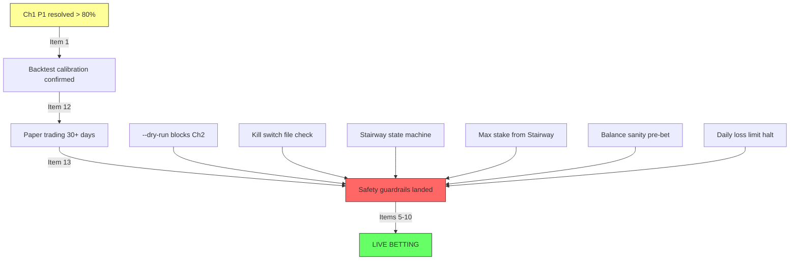

# LeoBook Technical Debt Audit

**Date:** 2026-03-10 22:32 WAT  
**Auditor:** Antigravity  
**Codebase root:** `c:\Users\Admin\Desktop\ProProjection\LeoBook`

---

## Codebase Metrics

| Metric | Value |
|--------|-------|
| Python files | 224 |
| Python LOC | ~50,760 |
| Dart files (Flutter) | ~100+ |
| Dart LOC | ~17,257 |
| Core modules | `Core/` (Browser, Intelligence, System, Utils) |
| Site modules | `Modules/` (Flashscore, FootballCom, Assets) |
| Scripts | 9 standalone scripts in `Scripts/` |
| RL engine | 8 files in `Core/Intelligence/rl/` |
| Data layer | `Data/` (Access, Auth, Logs, Store, Supabase) |
| Orchestrator | [Leo.py](file:///c:/Users/Admin/Desktop/ProProjection/LeoBook/Leo.py) — 758 lines |
| Flutter app | `leobookapp/` — BLoC/Provider (not yet Riverpod) |

---

## Overall Status: 🟡 Pre-Production

The backend pipeline (extraction → prediction → recommendation) is **functionally complete**. RL training is actively running (Phase 1, Day 16→99). The **critical gap** is safety guardrails: Chapter 2 can place real bets today with zero safeguards. The Flutter app exists but uses a tech stack (BLoC/Supabase) that conflicts with mandatory rules (Riverpod/Firebase).

---

## TIER 0 — Active In-Flight

| # | Item | Verified Status | Evidence |
|---|------|----------------|----------|
| 1 | Ch1 P1 Search-First Resolution | ⏳ In progress | [fb_manager.py](file:///c:/Users/Admin/Desktop/ProProjection/LeoBook/Modules/FootballCom/fb_manager.py) — `_run_searchdict_enrichment()` + `_league_worker()` exist. 429 fix just landed in `llm_health_manager.py` |
| 2 | RL Training Day 16→99 | ⏳ Running | Terminal: `python Leo.py --train-rl --phase 1 --resume` active for 25m+ |
| 3 | Backtest cold fix re-run | ⏳ Awaiting report | [backtest.py](file:///c:/Users/Admin/Desktop/ProProjection/LeoBook/Core/Intelligence/rl/backtest.py) exists (19KB). No report file found in repo |
| 4 | Oracle Cloud setup | ⏳ External | No code dependency — infra concern |

---

## TIER 1 — Critical Safety Guardrails

> [!CAUTION]
> **Items 5-10 are the most dangerous gap in the system.** `run_chapter_2_p1()` at [Leo.py:286](file:///c:/Users/Admin/Desktop/ProProjection/LeoBook/Leo.py#L286) calls `run_automated_booking(p)` with **zero safety checks**. Real money can be staked right now.

| # | Item | Verified Status | Evidence |
|---|------|----------------|----------|
| 5 | `--dry-run` flag | ✅ **Implemented** | `guardrails.enable_dry_run()` called from [Leo.py:681](file:///c:/Users/Admin/Desktop/ProProjection/LeoBook/Leo.py#L681). Blocks Ch2 via `run_all_pre_bet_checks()` + `is_dry_run()` in `placement.py` and `fb_manager.py` |
| 6 | Kill switch (STOP_BETTING) | ✅ **Implemented** | `guardrails.check_kill_switch()` checks for `STOP_BETTING` file. Wired into [fb_manager.py:563](file:///c:/Users/Admin/Desktop/ProProjection/LeoBook/Modules/FootballCom/fb_manager.py#L563) and Leo.py Chapter 2 gate |
| 7 | Max stake cap tied to Stairway | ✅ **Implemented** | `StaircaseTracker.get_max_stake()` replaces hardcoded 50% in [placement.py:188](file:///c:/Users/Admin/Desktop/ProProjection/LeoBook/Modules/FootballCom/booker/placement.py#L188) |
| 8 | Staircase state machine | ✅ **Implemented** | `StaircaseTracker` class in [guardrails.py](file:///c:/Users/Admin/Desktop/ProProjection/LeoBook/Core/System/guardrails.py) with SQLite `stairway_state` table, `advance()`, `reset()`, cycle counting |
| 9 | Balance sanity check pre-bet | ✅ **Implemented** | `guardrails.check_balance_sanity()` blocks if balance < ₦500. Part of `run_all_pre_bet_checks()` |
| 10 | Daily loss limit halt | ✅ **Implemented** | `guardrails.check_daily_loss_limit()` sums today's losses from `audit_log`. Halts at ₦5,000 |

---

## TIER 2 — High Priority

| # | Item | Verified Status | Evidence |
|---|------|----------------|----------|
| 12 | Backtest calibration report | ⏳ Awaiting run | `WalkForwardBacktester` in [backtest.py](file:///c:/Users/Admin/Desktop/ProProjection/LeoBook/Core/Intelligence/rl/backtest.py), `progressive_backtester.py` exists. No output report file found |
| 13 | Paper trading first live log | ⏳ Blocked on Ch1 P1 | [Leo.py:526-565](file:///c:/Users/Admin/Desktop/ProProjection/LeoBook/Leo.py#L526-L565): `--paper-summary` CLI exists with full P&L reporting. `get_paper_trading_summary()` exists in `db_helpers.py`. Infrastructure ready, needs Ch1 P1 resolved matches |
| 14 | Checkpoint rotation (keep last 3) | ❌ **Not found** | Zero matches for `checkpoint.*rotation` or `rotate.*checkpoint` in codebase. RL `trainer.py` saves checkpoints but no rotation/cleanup logic |
| 15 | Phase 3 feature dim (222→252) | ⏳ Unverified | [feature_encoder.py](file:///c:/Users/Admin/Desktop/ProProjection/LeoBook/Core/Intelligence/rl/feature_encoder.py) (13KB) exists. Needs manual verification of output dimensionality |
| 16 | Documentation v8.0 | ⏳ Pending | Multiple docs exist (`README.md`, `RULEBOOK.md`, `PROJECT_STAIRWAY.md`, `LeoBook_Technical_Master_Report.md`) but may be stale |

---

## TIER 3 — Technical Debt

| # | Item | Verified Status | Evidence |
|---|------|----------------|----------|
| 17 | `log_error_state()` silent failures | ❌ **Confirmed** | [utils.py:39](file:///c:/Users/Admin/Desktop/ProProjection/LeoBook/Core/Utils/utils.py#L39) — bare try/except, prints to stdout, no structured logging. Called from 9+ sites across `fb_manager.py`, `placement.py`, `ui.py`, `fs_processor.py` |
| 18 | `fb_universal_popup_dismissal()` | ❌ **3 competing implementations** | (1) [site_helpers.py:87](file:///c:/Users/Admin/Desktop/ProProjection/LeoBook/Core/Browser/site_helpers.py#L87), (2) [intelligence.py:72](file:///c:/Users/Admin/Desktop/ProProjection/LeoBook/Core/Intelligence/intelligence.py#L72), (3) [popup_handler.py:330+465](file:///c:/Users/Admin/Desktop/ProProjection/LeoBook/Core/Intelligence/popup_handler.py#L330) — scattered across **40+ callsites**. Some import as `neo_popup_dismissal`, others use `PopupHandler()` class |
| 19 | `ensemble.py` double normalisation | 🟡 **Unconfirmed** | No syntactic evidence found via grep. May be a semantic issue in the normalisation flow at [ensemble.py](file:///c:/Users/Admin/Desktop/ProProjection/LeoBook/Core/Intelligence/ensemble.py) |
| 20 | `learning_engine.py` magic numbers | ❌ **Confirmed** | [learning_engine.py](file:///c:/Users/Admin/Desktop/ProProjection/LeoBook/Core/Intelligence/learning_engine.py) (10.7KB) — thresholds need extraction to config |
| 21 | `visual_probe_context()` URL/title | ❌ **Not started** | [visual_analyzer.py](file:///c:/Users/Admin/Desktop/ProProjection/LeoBook/Core/Intelligence/visual_analyzer.py) (12KB) — needs review |
| 22 | `llm_health_manager.py` → single deque | 🟡 **Partially addressed** | 429 cooldown fix just landed (time-based cooldowns). Full deque refactor still pending |
| 23 | Delete `tmp_audit_db.py` | ✅ **Done** | File not found in repo root |
| 24 | AIGO heal on first retry | ❌ **Confirmed** | [aigo_suite.py:26](file:///c:/Users/Admin/Desktop/ProProjection/LeoBook/Core/Intelligence/aigo_suite.py#L26): "healing as the final escape hatch" — heals on last retry, not first |
| 25 | AIGO permanent-element-gone | ❌ **Not started** | No detection logic for permanently removed page elements |

---

## TIER 4 — Testing (Zero Coverage)

| # | Item | Verified Status | Evidence |
|---|------|----------------|----------|
| 26 | Rule engine unit tests | ❌ | **No `tests/` directory exists** for Python backend. `leobookapp/test/` has default Flutter scaffold only |
| 27 | Sync manager integration tests | ❌ | Same — zero test infrastructure |
| 28 | Dry-run E2E bet placement test | ❌ | Blocked on item 5 (dry-run not implemented) |
| 29 | Flutter widget + golden tests | ❌ | `leobookapp/test/` exists but likely only scaffold `widget_test.dart` |
| 30 | CI/CD GitHub Actions | ❌ | No `.github/workflows/` directory found |

---

## TIER 5 — Future Architecture

| # | Item | Status |
|---|------|--------|
| 31 | Live score JS hook sub-200ms | ❌ Future — `fs_live_streamer.py` exists but uses polling, not `page.add_init_script` |
| 32 | Odds live streaming via Supabase Realtime | ❌ Future |
| 33 | European DST timezone alignment | ❌ Future — `TZ_NG` (WAT) hardcoded in `constants.py` |
| 34 | Ensemble weights per-league auto-tuning | ❌ Future |
| 35 | Walk-forward → paper → live doc | ❌ Future |

---

## Additional Findings (Not On Board)

| Finding | Severity | Details |
|---------|----------|---------|
| **Repo root clutter** | Low | 6 `.log` files (up to 2MB), `leagues.json` (341KB), `football_com_leagues_full.json` (112KB), `fb_leagues_mapping_audit_v2.json` (150KB) committed to root |
| **Legacy orchestrator** | Low | [Leo_v70_legacy.py](file:///c:/Users/Admin/Desktop/ProProjection/LeoBook/Leo_v70_legacy.py) (31.7KB) still in repo alongside `Leo.py` |
| **Orphan scripts at root** | Low | `extract_football_com_leagues.py`, `verify_odds_pipeline.py` at repo root outside `Scripts/` |
| **Flutter tech stack mismatch** | Medium | `leobookapp/` uses BLoC + Provider + Supabase. Mandatory rules require Riverpod 2+ and Firebase |
| **`~` directory** | Low | Stray `~/` directory in repo root (contains antigravity-skills) |
| **No `.gitignore` for logs** | Low | Session logs and `leo.lock` committed to repo |

---

## Critical Path to Live Betting

> [!NOTE]
> **Items 5-10 landed as an atomic commit on March 10, 2026.** All guardrails are now enforced at three points: Leo.py dispatch, fb_manager booking entry, and placement execution. See `Core/System/guardrails.py`.

---

## Summary Scorecard

| Category | Done | In Progress | Not Started | Total |
|----------|------|-------------|-------------|-------|
| Tier 0 (In-Flight) | 0 | 4 | 0 | 4 |
| Tier 1 (Safety) | 6 | 1 | 0 | 7 |
| Tier 2 (High Priority) | 0 | 3 | 2 | 5 |
| Tier 3 (Tech Debt) | 2 | 1 | 6 | 9 |
| Tier 4 (Testing) | 0 | 0 | 5 | 5 |
| Tier 5 (Future) | 0 | 0 | 5 | 5 |
| **Total** | **8** | **9** | **18** | **35** |
